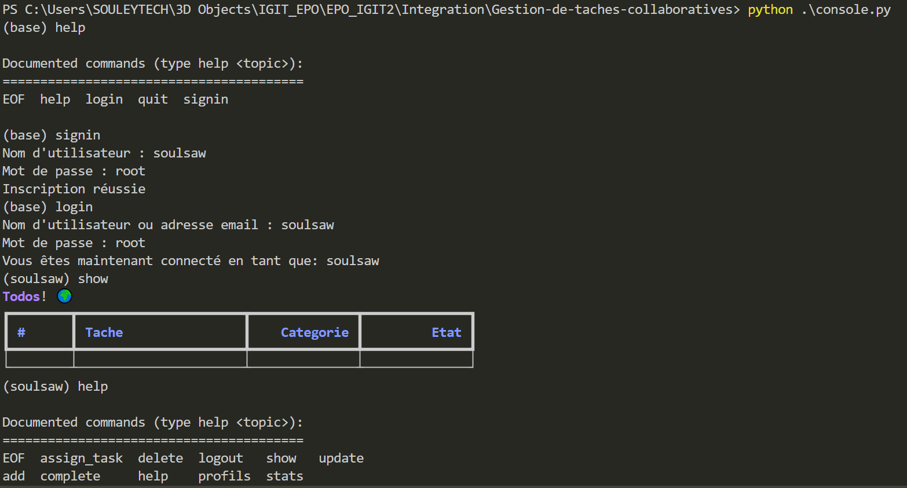
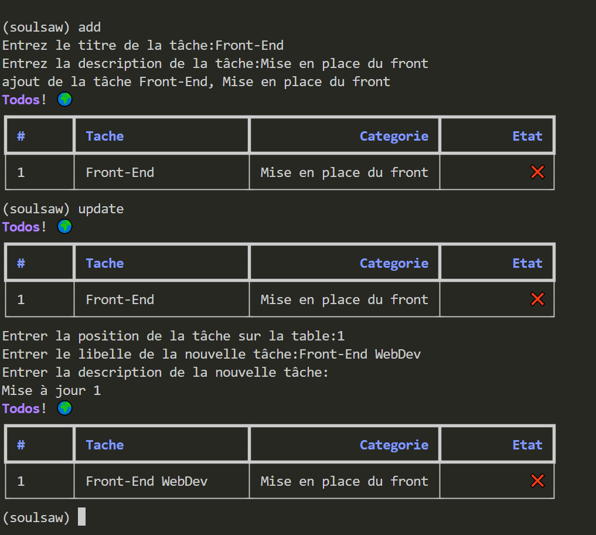
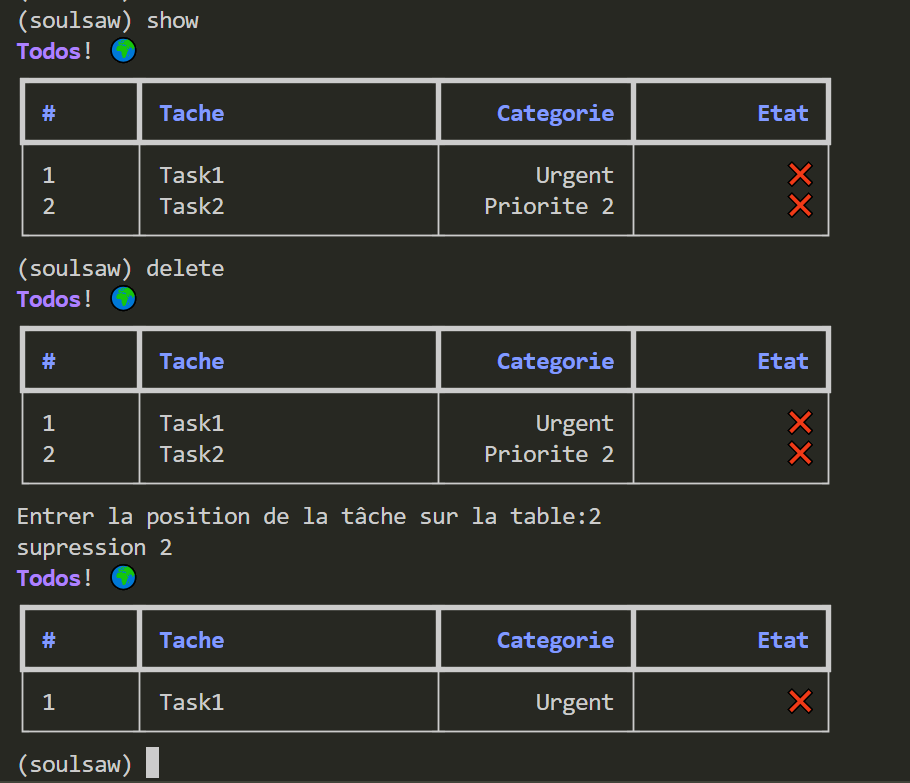
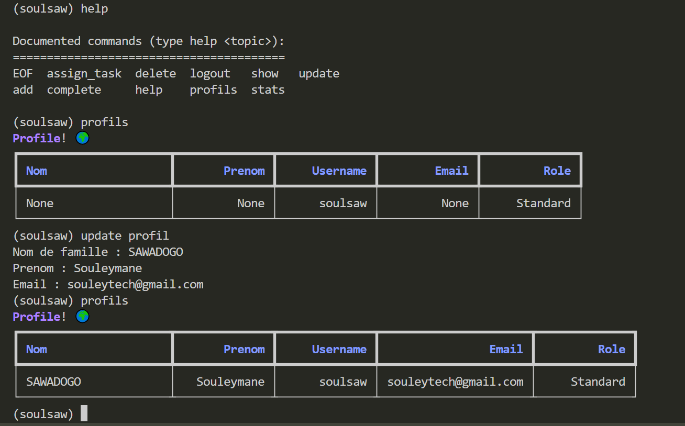
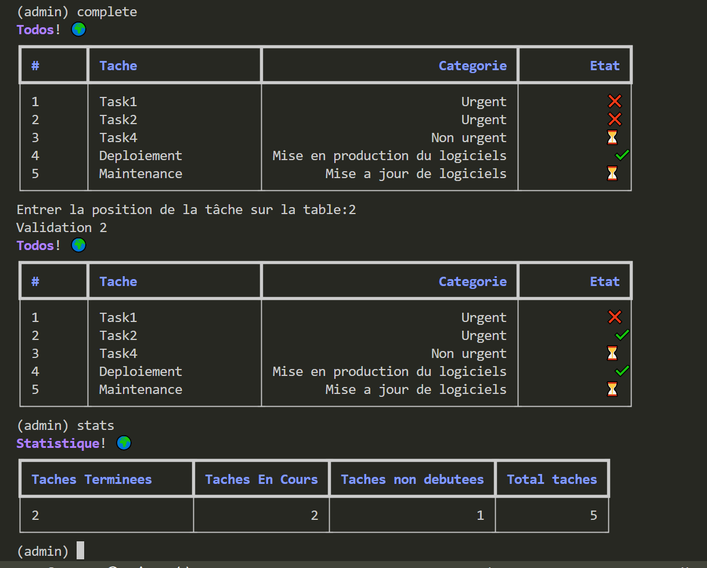
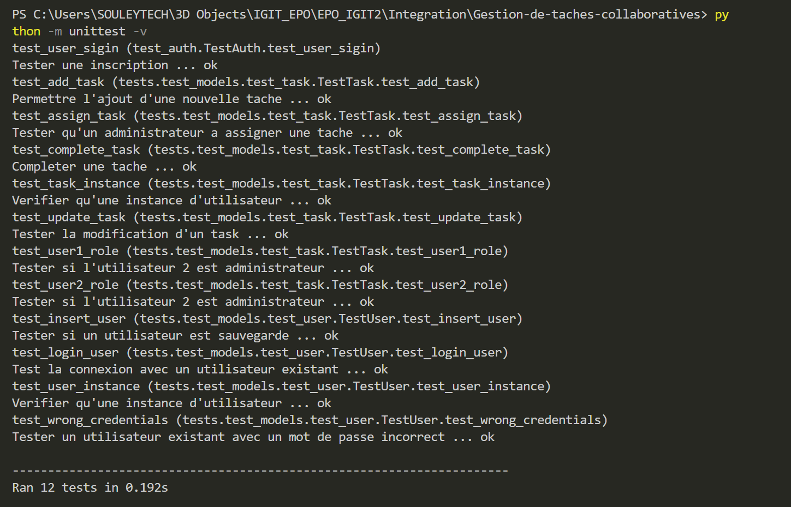

# Gestion des Taches collaboratives
- [Collaborateurs](#Collaborateurs)
- [Dependances](#Dependances)
- [Structure](#Structure)
- [Excecution](#Execution)
- [Résultats](#Résultats)
## Collaborateurs
[Compaore Walker](https://github.com/WalkerStanislas) &&
[SAWADOGO Souleymane](https://github.com/Soulsaw)
## Dependances
Pour executer ce projet il est necessaires d'avoir ``python3.10`` ou une version superieur et de s'assurer d'avoir les dependances ``sqlit3`` ``rich`` et ``typer`` dans la machine. Ces dependances sont necessaires pour l'execution du projet. Au cas ou ses dependances ne sont pas installés, ils peuvent être installé par les commandes suivantes:
---
> ``pip install sqlite3``
---
> ``pip install typer``
---
> ``pip install  rich``
---
Une fois que ces dependances sont installés, voyont ensemble comment executer le projet dans la prochaine section.
## Structure
La structure du projet est comme suite:
---
D'abord il y'a un package ``models`` contenant trois fichiers:
1. [__init__.py](models/__init__.py) Qui permet de rendre le dossier ``model`` en package et aussi contient le code permet la connection a la base de donnée ``Sqlite``.
2. [user.py](models/user.py) Ce fichier contient des fonctions permettant d'`inserer` de `supprimer`, la `mise a jour`, l'obtention de la `liste des utilisateur`, obtenir le `nombre total d'utilisateur` et enfin permet de `retrouver un utilisateur a travers son nom d'utilisateur ou son adresse email`
3. [task.py](models/task.py) Ce fichier à les même `propriété que le precédant mais pour les taches`.
---
Ensuite on à un package `tests` contenant les fichiers suivants:
1. [__init__.py](tests/__init__.py) Pour rendre le `dossier` en package
2. [test_user.py](tests/test_models/test_task.py) Contenant l'implementation des test unittaire pour les [taches](models/task.py)
3. [test_task.py](tests/test_models/test_user.py) Contenant l'implementation des test unitaires pour l'[utilisateur](models/user.py)
---
- [auth.py](auth.py) Contenant les fonctions pour l'authentification et l'inscription d'un utilisateur
- [test_auth.py](test_auth.py) Contenant les tests pour l'[authentification](auth.py)
- [sub_console.py](sub_console.py) Contenant l'implementation d'un module `cmd` pour l'interaction avec un utilisateur déjà connecté.
- [console.py](console.py) Contenant l'implementation d'un module `cmd`, et constitue le premier contact avec l'utilisateur. Cette ``console`` donne l'option a un utilisateur de soit `se connecter` ou de `s'incrire` s'il n'a pas encore de compte.
## Execution
Pour executer le présent projet, il suffit de ce placé dans la racine du projet et executer la commande ``python console.py`` pour lancer la console principale.
---
Les testes unitaires peuvent aussi être exécuter avec la commande `python -m unittest -v`.
## Resultats
Ceci constitue quelques resultats d'exécution.
1. Inscription et Connexion

2. Ajout de task et mise a jour

3. Suppression et affichage de la liste des taches

4. Affichage profile utilisateur et mise a jour de son profile

5. Assigner une tache

6. Completer un task

7. Test unitaire

